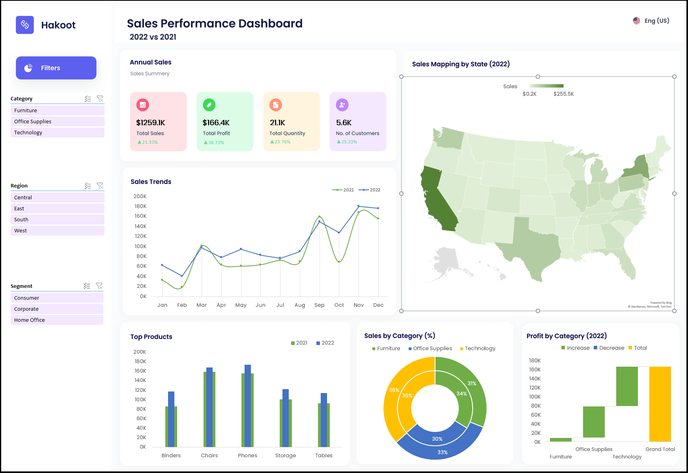

# Dynamic-Sales-Performance-Tracker: Current vs Previous Year

## Project Overview
This project focuses on analyzing year-over-year sales performance for **Hakoot**, an e-commerce website operating in the US. The **Dynamic Sales Performance Dashboard** was built using Excel to visualize and compare key metrics from 2021 and 2022, providing actionable insights for strategic decision-making.

## Key Insights
- :white_check_mark: **Total Sales** for 2022 saw a significant increase of **21.33%**, surpassing 2021.
- :white_check_mark: **Total Profit** rose by **38.73%**, while **total quantity sold** increased by **25.76%** compared to the previous year.
- :white_check_mark: **Top Product Categories** (2022) change to **Technology (36%)**, **Office Supplies (33%)**, and **Furniture (31%)**.
- :white_check_mark: **Top States** contributing to 2022 sales are **California, New York, and Texas**, with California being the highest contributor.
- :white_check_mark: Comparative analysis shows higher monthly sales across most months in 2022, peaking in November and December.

## Final Strategy to Enhance Sales
- :dart: **Target Major States**: California, New York, and Texas account for a significant portion of sales. Enhancing promotions and customer engagement efforts in these states can drive further growth.
- :dart: **Leverage Technology and Office Supplies**: Both categories have seen strong sales, especially Technology, which accounts for the largest share of total sales. Targeted promotions and bundled offers for these categories may maximize profits.
- :dart: **Boost Sales in Low-Performing Months**: While November and December were peak months in both years, focusing on marketing during slower months (e.g., February, July) could help maintain steady sales growth throughout the year.
- :dart: **Capitalize on Profit Opportunities**: The **waterfall chart** for 2022 highlights significant profit gains, particularly in the Technology category. Strategic investment in inventory and marketing for high-profit products is crucial.

## Sales Dashboard (Excel)

Below is the visual representation of the **Dynamic Sales Performance Dashboard**:

## Project Details
- **Data Cleaning**: Removal of duplicate entries, trimming unnecessary spaces, applying proper casing, splitting data into meaningful columns, and handling missing values.
- **Dashboard Design**: Features dynamic KPIs for total sales, profit, quantity sold, and customer count. Interactive slicers allow filtering by category, region, and segment, providing users with an intuitive way to compare metrics across different dimensions.
- **Comparative Charts**: Includes line charts to show sales trends over time, bar-in-bar charts for product subcategory comparison, a double doughnut chart for category contributions, and a **sales by state** map to visually highlight geographical sales distribution.

This project demonstrates the power of Excel for **sales performance tracking** and **data-driven decision-making** in the e-commerce sector.
